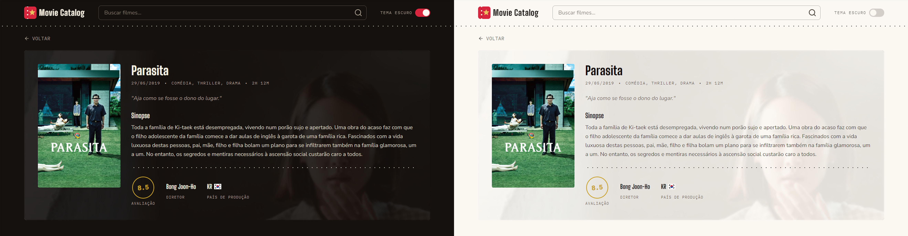

 

[](https://movie-catalog-sage.vercel.app)

### Preview 📸


# Movie Catalog 🎥

Catálogo de filmes desenvolvido com React e TypeScript, onde é possível acompanhar os títulos em alta, realizar pesquisas e visualizar informações detalhadas de cada filme. O projeto consome a API do TMDb e oferece uma interface responsiva com suporte a tema claro e escuro.

## Funcionalidades 🚀

- Acompanhar os filmes mais populares do momento
- Pesquisar filmes específicos
- Ver detalhes dos filmes
- Responsividade mobile
- Tema claro e escuro

## Tecnologias utilizadas 🧩
- React
- TypeScript
- Vite
- Tailwind CSS
- Biome
- [The Movie Database API (TMDb)](https://www.themoviedb.org/documentation/api)

## Instalação 🛠️

1. Clone o repositório e instale as dependências
```bash
git clone https://github.com/matheusc1/movie-catalog
npm install
```

2. Se cadastre no [TMDb](https://www.themoviedb.org/documentation/api) e pegue uma chave API

3. Crie um arquivo `.env`, uma variável chamada `VITE_TMDB_API_KEY` e cole a chave API

4. Execute o projeto
```bash
npm run dev
```

## Design 🎨

Identidade visual com tema de ingresso de cinema (ticket stub), com paleta, tipografia e componentes próprios desenhados durante o refactor do projeto.

Protótipo no Figma: [Movie Catalog](https://www.figma.com/design/8FRBJSj3mKpcv6s6ZulXaE/movie-catalog?node-id=222-102&t=gfZyVJPdjcOhaYKs-1)

## License 🧾
Este projeto está licenciado sob a licença MIT. Veja o arquivo [LICENSE](LICENSE) para mais detalhes.
